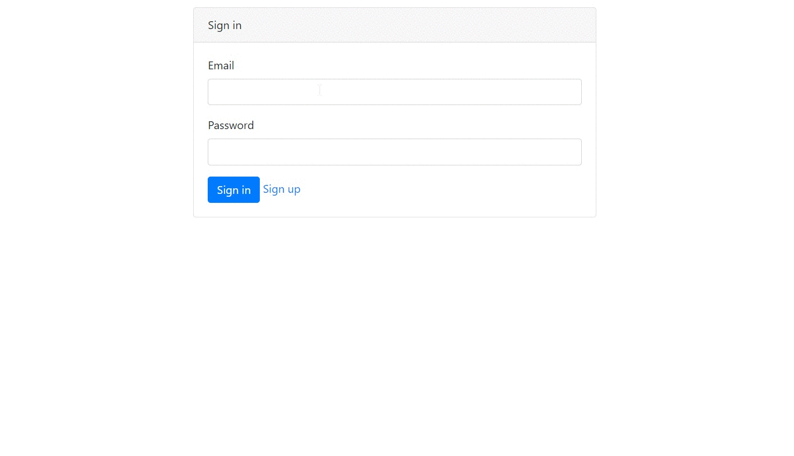

# TODO List

## О проекте
Приложение для ведения списка задач.

## Функционал
* CRUD операции с Hibernate и PostgreSQL
* Взаимодействие frontend-a с backend-ом основано на передаче сообщений в формате JSON

## Используемые технологии
* Hibernate/PostgreSQL
* Servlets
* Maven
* Apache Tomcat
* Travis CI
* Gson
* HTML, Bootstrap, JS, Axios (front)
* Архитектурный паттерн MVC

## Демо

#### Общий вид

#### Просмотр всех задач
